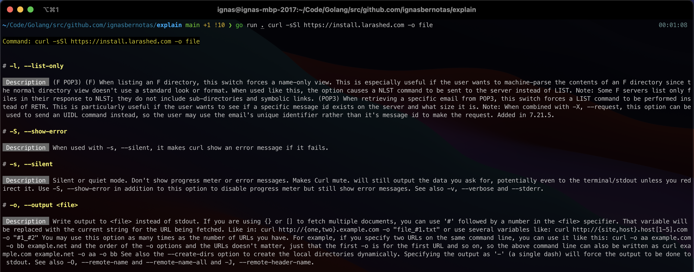
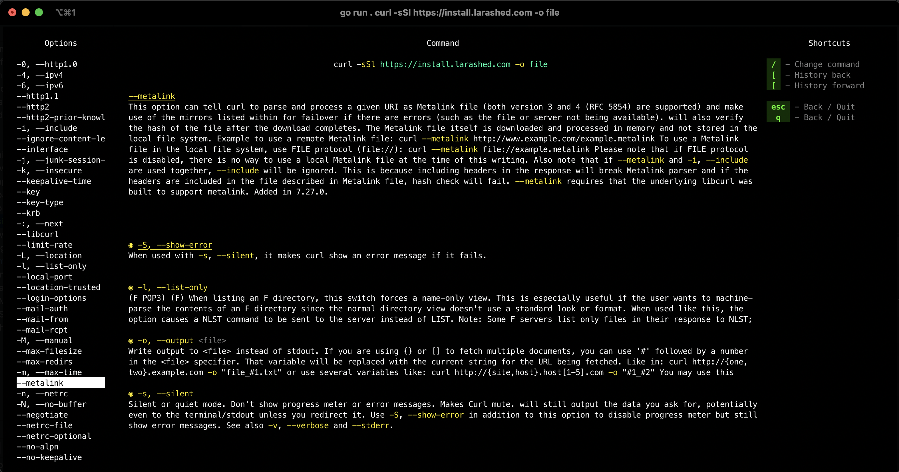
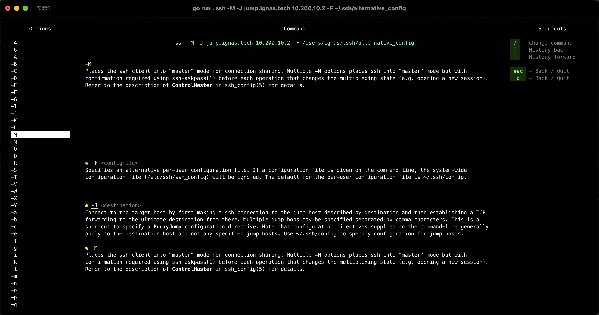

# `Explain` command-line tools

Do you remember the difference between `curl -s` and `curl -S`? I often don't.

We can run `man curl`, scroll down, and read about it, but it's a little tiresome. 
Let's say your colleague sends you a command to perform some action on your local env. Matching each option in the man pages is inconvenient, yet you still need to know precisely what you're running.

This tool simplifies things by displaying option descriptions right in your terminal through a simple or an interactive UI.

---

This project intends to give developers a simple way to analyze most commonly used CLI tools such as `curl`, `ssh`, `ab` and eventually more moderns tools like `k8s`, `nomad`, `consul` or even language interpreters like `php`, `python`, `go` or `ruby`.

---

### Features

- Responsive layout
- Command option descriptions
- Selected option value format display
- Links within descriptions to other options
- Keyboard shortcuts
  - Sidebar
    - Arrow up / down
  - History
    - [ - Go back
    - ] - Go forward
    - esc / q - Close modal or quit the app
  - Change command
    - / - opens a modal form
- Mouse click support

### Usage

For now, you have to build it yourself. I will be setting up Github Actions to build release artifacts and set up Homebrew (which now supports WSL) to make it easily distributable.

#### Building an executable

```shell
go get -d github.com/ignasbernotas/explain
```

```shell
cd $GOPATH/src/github.com/ignasbernotas/explain && go install 
```

Make sure `$GOPATH/bin` is in your `$PATH`: `export PATH="$PATH:$GOPATH/bin"`

## Running

### Non-interactive mode

```shell
explain curl -sSl https://install.larashed.com -o file
```



### Interactive mode

```shell
explain -i curl -sSl https://install.larashed.com -o file
```

### `curl`



### `ssh`




### Current implementation

`explain` attempts to read and parse `man` pages for the given command.
`man` pages use `groff`/`troff` syntax to format the output; however, there's no one structure to writing software manuals.
Different manuals are structured and formatted differently; therefore, content/structure unification isn't easily achievable.
I've only had a little time to build this, so I only tested it with `curl`, `ab` and `ssh`. 

Parsing `man` pages turned out to be more difficult than anticipated, so I took shortcuts and made some hacky attempts to do it.
I could not find a complete-enough Go implementation of a man page parser (there's only a single project on Github) so if someone has experience writing lexers/parsers and you're interested in helping out, please reach out to me.

#### Limitations

- Tview does not support multiline (\n\n); I've tried looking for a workaround with no success so far.
- `man` page parsing is supported per tool, and this is less than perfect

#### Dependencies
This project uses Go modules, so all project dependencies are defined in [go.mod](./go.mod).

Due to some limitations in the UI, I had to fork and modify the [tview](https://github.com/rivo/tview) library.

### Roadmap

Many modern tools are built on top of CLI frameworks with built-in help commands, yet there's no standardized way to fetch that information without invoking each subcommand individually. Another problem is that nobody writes `man` pages anymore (this might be an overstatement), so it kind of makes sense to move forward towards a different direction than parsing `*roff` syntax.

Not sure if there's enough demand for this, but for the purposes of this tool, I'll be looking at ways to hook into these frameworks instead of parsing STDOUT after execution.

The current plan is to support tools using these popular `Go` libraries:

- https://github.com/spf13/cobra (used by Docker, Kubernetes, Doctl, Hugo)
- https://github.com/mitchellh/cli (used by Hashicorp tools)
- https://github.com/urfave/cli (used by Grafana, Ethereum, Mysterium Network)

Thousands, if not hundreds of thousands, of projects, depend on these libraries for their command-line interfaces.
It would be pretty cool if there were a unified way to generate standardized documentation for all of them.

#### Next in line for `explain`
- `ansible`
- `nomad`
- `docker`
- `docker-compose`
- ?

If you find this interesting, or you'd like to chat - reach out to me at [ignas@iber.lt](mailto:ignas@iber.lt) or create an issue in this repo.
